# Проект по автоматизации тестирования UI для веб-приложения [Amazon](https://www.amazon.com/)

## Покрытый функционал
> Разработаны автотесты на <code>UI</code>.
- :white_check_mark: Првоерка отображения верного тайтла
- :white_check_mark: Проверка отображения информации в футере
- :white_check_mark: Проверка отображения пунктов меню в навигационной панели у неавторизованного пользователя
- :white_check_mark: Проверка отображения искомых товаров на странице результатов поиска
- :white_check_mark: Проверка отображения категорий в фильтре "Категория" на странице поиска товаров
- :white_check_mark: Проверка отображения категорий в блоке обзора по категориям на основной странице категории товара
- :white_check_mark: Отсутствие ошибок в журнале консоли страницы

## Технологический стек

<p align="center">


</p>

> В данном проекте автотесты написаны на <code>Java</code> с использованием фреймворков <code>Selenide</code> для UI-тестов.
>
> <code>Selenoid</code> выполняет запуск приложения на удаленном сервере в контейнерах <code>Docker</code>.
>
> <code>JUnit 5</code> используется для модульного тестирования
>
> <code>Gradle</code> используется для автоматизированной сборки проекта
>
> <code>Jenkins</code> выполняет запуск тестов
>
> <code>Allure Report</code> формирует отчет о запуске тестов
>
> Автотесты интегрируются с тест-менеджмент системой <code>Allure TestOps</code> и таск-трекер системой <code>Jira</code>
>
> В <code>Telegram</code> отправляются уведомления о пройденном прогоне с помощью библиотеки [allure-notifications](https://github.com/qa-guru/allure-notifications)

## Запуск тестов из терминала
### Локальный запуск тестов

```
gradle clean test
```

### Удаленный запуск тестов с заполненным файлом _credentials.properties_

```
gradle clean test
-DremoteURL=${REMOTEURL}
-Dbrowser=${BROWSER}
-DversionBrowser=${BROWSER_VERSION}
-DbrowserSize=${BROWSER_SIZE}
-Dthreads=${THREADS}
```
> <details>
> <summary> :point_left: <code>credentials.properties</code> </summary>
>
> **В файле должны быть расположены:**
> + <code>login</code> и <code>password</code> – данные для авторизации на удаленном сервере, на котором будут запускаться тесты
> </details>


### Параметры сборки

> <code>REMOTE_URL</code> – адрес удаленного сервера, на котором будут запускаться тесты.
>
> <code>BROWSER</code> – браузер, в котором будут выполняться тесты (_по умолчанию - <code>chrome</code>_).
>
> <code>BROWSER_VERSION</code> – версия браузера, в которой будут выполняться тесты (_по умолчанию - <code>91.0</code>_).
>
> <code>BROWSER_SIZE</code> – размер окна браузера, в котором будут выполняться тесты (_по умолчанию - <code>1920x1080</code>_).
>
> <code>THREADS</code> – количество потоков для запуска тестов.
##  Для запусков автотестов используется [Jenkins](https://jenkins.autotests.cloud/job/09-Ambidre-mobile_tests/)

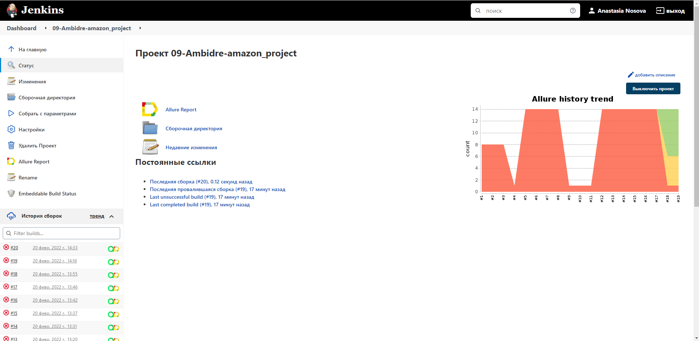

##  Анализ результатов запусков в Jenkins через Allure Reports

> <code>Allure-framework</code>используется в качестве инструмента для построения отчетов о прогоне автотестов.
> Он позволяет получить информацию о ходе выполнения тестов, а также прикрепить скриншоты, логи и видео к формируемому отчету.
> Имеется возможность указать различные теги, приоритеты и прочую сопутствующую информацию для тестов.

### Главная страница Allure-отчета

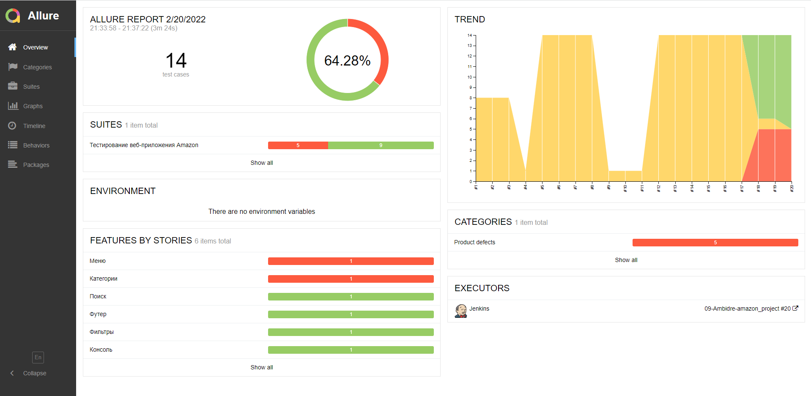

### Информация о тестовом прогоне в графическом виде

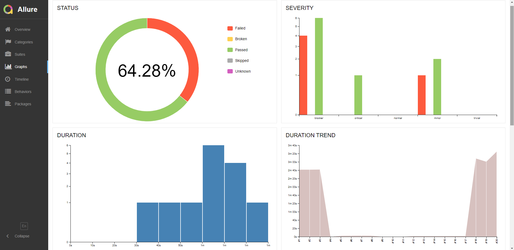

### Группировка тестов по проверяемому функционалу

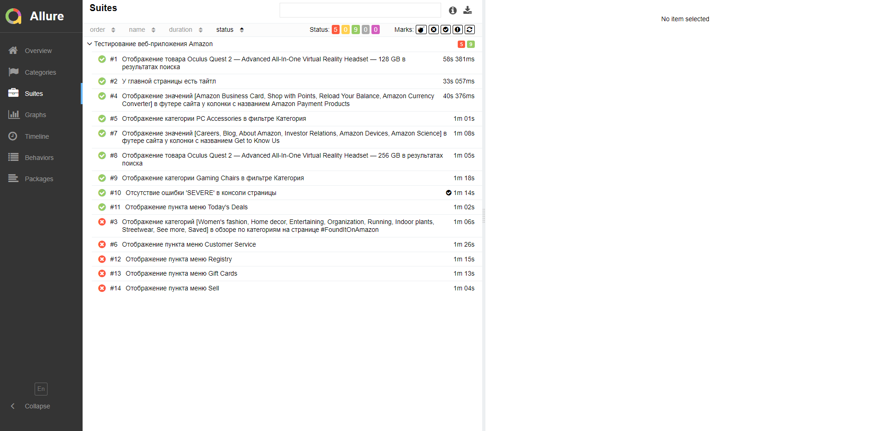

##  Интеграция тестов c тест-менеджмент системой [Allure TestOps](https://allure.autotests.cloud/jobrun/9938)

> <code>Allure TestOps</code> используется для хранения всех авто и ручных тестов, запусков и их результатов, а также статистики и отчетов.

### Основной дашборд

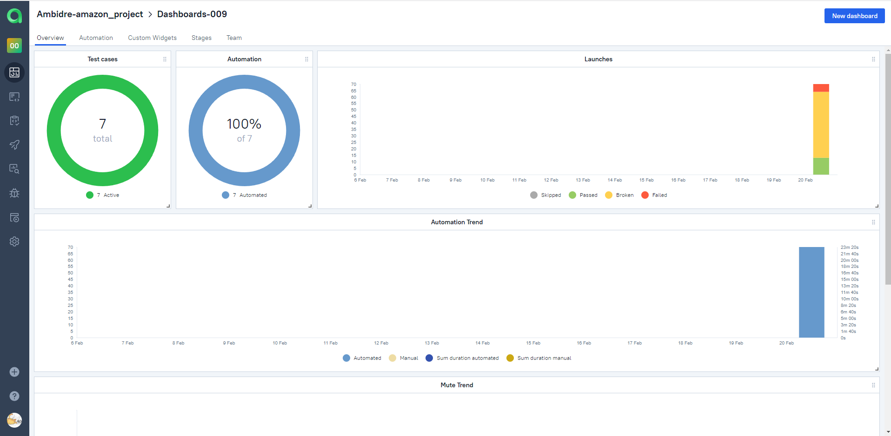

### Дашборд для отображения успешности и длительности тестов

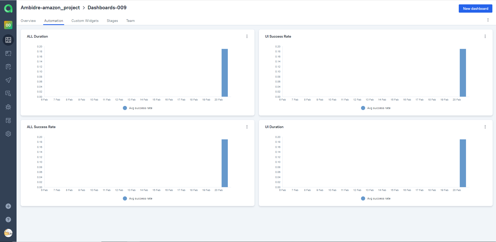

### Дашборд по стендам

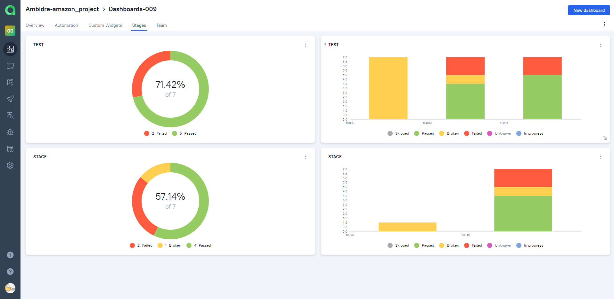

### Дашборд по членам команды

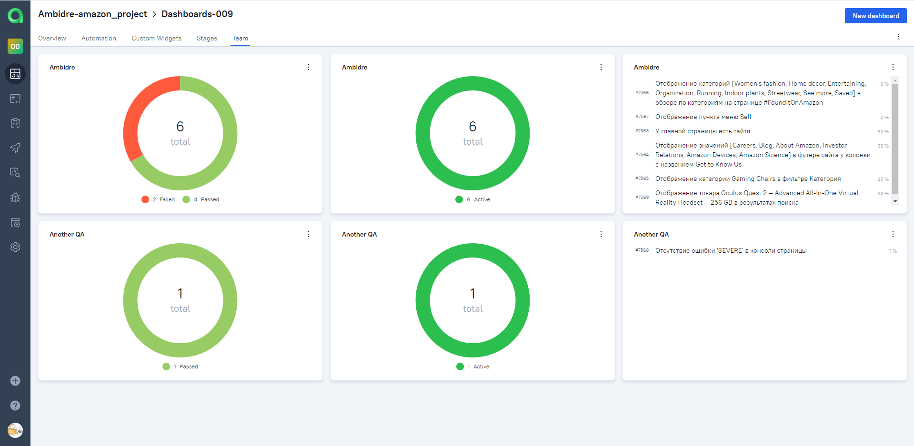

### Запуски тестов

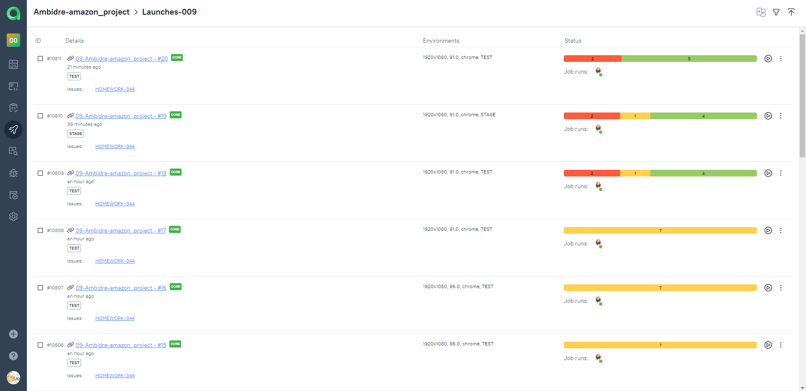

### Результаты запуска тестов

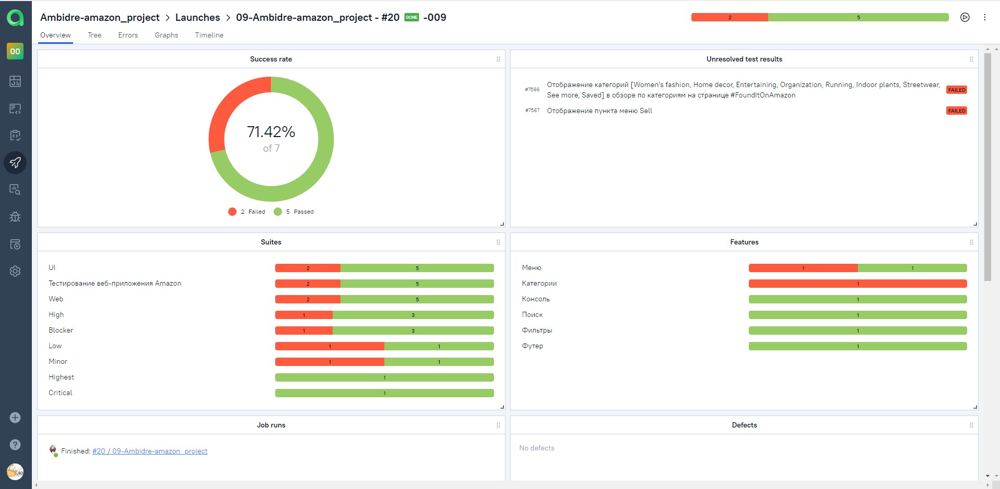

### Сгруппированные тест-кейсы по проверяемому функционалу

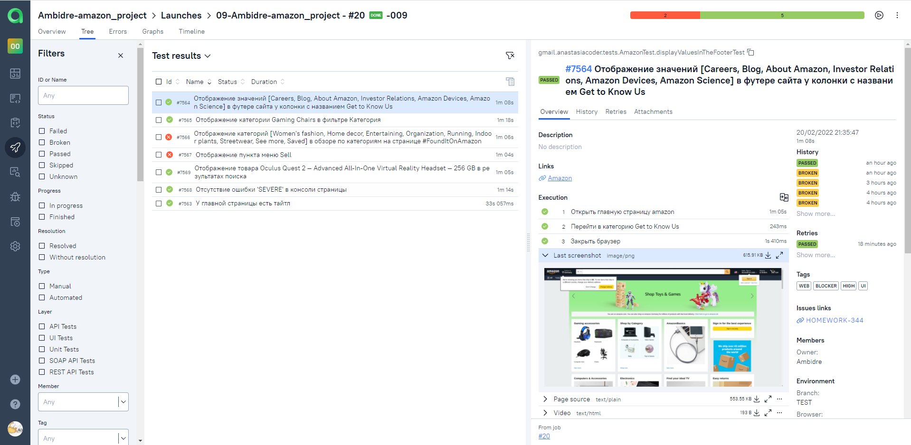

##  Интеграция тестов c таск-трекер системой [Jira](https://jira.autotests.cloud/browse/HOMEWORK-336)

> Интеграция с <code>Jira</code> позволяет добавлять в задачи тест-кейсы, запуски и их результаты.

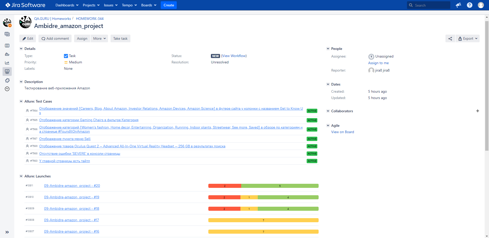

##  Уведомления в Telegram с использованием бота

> Реализована отправка уведомлений о прогоне с помощью бота в <code>Telegram</code>.

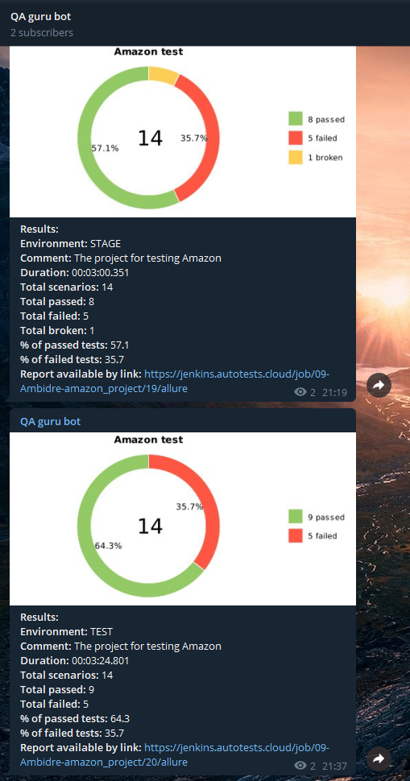

##  Пример запуска теста в Selenoid

> К каждому тесту в отчете прилагается видео. Одно из таких видео представлено ниже.


